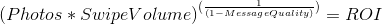
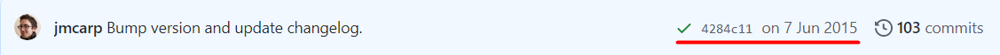
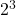

# Tinder Bot


Hey! guys, girls and other genders. Do you use the [Tinder](https://tinder.com)? If be honest I do not really like this application,  because in most of cases it merely spend your time. If you don't have the premium account your profile will more rarely appear at other users. Of course, if you do not spend the 24 hours per day to this application. So I'd like to extend your knowledge how does Tinder work.
Of course there are a lot of things which are influencing to your match rate. For instance, your location, age spectrum, nationality, profession, etc. However the main components are your profile (photos, description etc) and your swipe volume. Therefore, if your photos are not exquisite, or at least attractive - your Swipe Volume can equite the disbalance made by your photos. However if you're a student or a worker you don't have a lot of time to swipe the girls or boys 24/7. So, I've created the aplication which will swipe for you. [This](https://github.com/jeffmli/TinderAutomation) guy even broke down the reward system to the formula 



"*The better photos/good looking you are you have, the less you need to write a quality message. If you have bad photos, it doesn't matter how good your message is, nobody will respond. If you have great photos, a witty message will significantly boost your ROI. If you don't do any swiping, you'll have zero ROI.*"

## Table of Contents
- [Tinder Bot](#tinder-bot)
  - [Table of Contents](#table-of-contents)
  - [Instalation Prerequirements](#instalation-prerequirements)
  - [Installation](#installation)
    - [Ordinary Installation](#ordinary-installation)
    - [Using Setuptools](#using-setuptools)
  - [Usage](#usage)
    - [Fix robobrowser trouble](#fix-robobrowser-trouble)
    - [Configuration file](#configuration-file)
    - [Folders creating](#folders-creating)
    - [Data Scraping](#data-scraping)
      - [Data Sorting](#data-sorting)
    - [Data Preprocessing](#data-preprocessing)

## Instalation Prerequirements

1. First thing which crucial and demanded is the **[python3.8](https://www.python.org/downloads/)**. Note that the version has to be 3.8 or higher, otherwise the representation will be broken.
2. It sounds foolish, however you need the **[Git](https://git-scm.com/)**
3. The last, but not the least the **[Anaconda](https://www.anaconda.com/)**. It is required for the [jupyter notebook](https://jupyter.org/). However you could use [Google Drive](https://drive.google.com/) and [Google Colab](https://colab.research.google.com/), instead.

## Installation

### Ordinary Installation

1. **Clone repository:**
   >\> git clone https://github.com/JuiceFV/tinder_bot.git

2. **Follow to the destination directory, set** `virtualenv` **up and activate it**

    <details>
    <summary>Windows</summary>

    >\> cd tinder_bot

    >\> python -m venv env

    >\> cd env

    >\> cd Scripts

    >\> activate

    >\> cd ../..

    </details>

    <details>
    <summary>Linux</summary>

    >\> cd tinder_bot

    >\> python3 -m venv env && source env/bin/activate

    </details>

3. **Install requirements**
   >\> pip install -r requirements.txt

4. **If you will try to launch any of entrypoint, you will obtain this error:**
   Yep, robobrowser's developers forgot to add `.utils` up, so we do this instead of them.
   Follow [below](#fix-robobrowser-trouble) to fix this trouble.
  
5. **Adjust the configuration file (**`config.yaml`**) or create your own one**
   Check the **[Usage:Configuration File](#configuration-file)** to familiarize with details of setting configuration up.
  
6. **Launch a script**
   
    ***Note: before the launching of a script, please familiarize with the [usage](#usage) section.***

    The main script which swipes your date

    >\> python application/entry.py

    The script which allows you to make a dataset (choose girls/boys)

    >\> python application/validation_entry.py

      The script which sorts the images from so-called named files (`name1-no_name2-yes_name3-no_`) to like/dislike folders according to the ratio of the like dislike. The details are explained [below](#data-scraping).

      >\> python applicaton/image_sorting_entry.py

### Using Setuptools

[Setuptools](https://setuptools.readthedocs.io/en/latest/) is a pretty go package for the comfortable installation.

1. **Clone repository:**
   >\> git clone https://github.com/JuiceFV/tinder_bot.git

2. **Follow to the destination directory, set** `virtualenv` **up and activate it**

    <details>
    <summary>Windows</summary>

    >\> cd tinder_bot

    >\> python -m venv env

    >\> cd env

    >\> cd Scripts

    >\> activate

    >\> cd ../..

    </details>

    <details>
    <summary>Linux</summary>

    >\> cd tinder_bot

    >\> python3 -m venv env && source env/bin/activate

    </details>

3. **Install everything using setuptools**
   
   >\> python setup.py develop

   **Note:** Please do not use the `python setup.py install`, otherwise you will obtain a bunch of path's errors.

4. **If you will try to launch any of entrypoint, you will obtain this error:**
   Yep, robobrowser's developers forgot to add `.utils` up, so we do this instead of them.
   Follow [below](#fix-robobrowser-trouble) to fix this trouble.
  
5. **Adjust the configuration file (**`config.yaml`**) or create your own one**
   Check the **[Usage:Configuration File](#configuration-file)** to familiarize with details of setting configuration up.
  
6. **Launch a script**
   
    ***Note: before the launching of a script, please familiarize with the [usage](#usage) section.***

    The main script which swipes your date

    >\> bot_start

    The script which allows you to make a dataset (choose girls/boys)

    >\> validation

      The script which sorts the images from so-called named files (`name1-no_name2-yes_name3-no_`) to like/dislike folders according to the ratio of the like dislike. The details are explained [below](#data-scraping).

      >\> img_scrap
## Usage

Before you start playing with this bot, you have to perform some necessary actions, so that the bot works properly. 

### Fix robobrowser trouble

Due to robobrowser's developers made the last commit on 7 June 2015 and still didn't fix this trouble - you will get it in 2/3 launch scripts. 


```
  Traceback (most recent call last):
  File "validation_entry.py", line 7, in <module>
  from application.sources import Validator
  File "D:\GitHub\tb\application\sources\__init__.py", line 5, in <module>
  from .pytinder import Session
  File "D:\GitHub\tb\application\sources\pytinder\__init__.py", line 5, in <module>
  from .session import Session
  File "D:\GitHub\tb\application\sources\pytinder\session.py", line 5, in <module>
  from application.sources.pytinder.tinder_api import TinderAPI
  File "D:\GitHub\tb\application\sources\pytinder\tinder_api.py", line 9, in <module>
  from application.sources.pytinder.utilits import get_facebook_access_token
  File "D:\GitHub\tb\application\sources\pytinder\utilits.py", line 9, in <module>
  import robobrowser
  File "D:\GitHub\tb\env\lib\site-packages\robobrowser\__init__.py", line 3, in <module>
  from .browser import RoboBrowser
  File "D:\GitHub\tb\env\lib\site-packages\robobrowser\browser.py", line 8, in <module>
  from werkzeug import cached_property
  ImportError: cannot import name 'cached_property' from 'werkzeug' (D:\GitHub\tb\env\lib\site-packages\werkzeug\__init__.py)
  ```
  To fix it you have to follow this path 
  
  <details>
  <summary>Windows</summary>

  `~\path-to-cloned-rep\env\lib\site-packages\robobrowser\`,

  </details>

  <details>
  <summary>Linux</summary>

  `~/path-to-cloned-repenv/env/lib/python3.8/site-packages/robobrowser/`,

  </details>

  open the file `browser.py` and modify the line:
    
  ```python
  from werkzeug import cached_property
  ```

  to the line:

  ```python
  from werkzeug.utils import cached_property
  ```

### Configuration file

The bot requires a configuration. You can modify the default one or create your own. Note  that your own config doesn't overlap the default, it complements or overwrites claimed fields of the default one.
   
  `config.yaml` example:
  ```yaml
  session:
    facebook_id: 100010429005794
    facebook_email: <email>
    facebook_password: <password>

  seen_profiles:
    filename: 'showed_profiles.txt'

  canvas:
    size: {width: 12, height: 6}
    judges:
      labels: ['Like', 'Dislike']
      names: ['milka']
      boxes_pos: {milka: [0.05, 0.4, 0.1, 0.15]}

  model:
    path: 'milka_model_V3.h5'
    img_size: 100
```
- **session** -- the session's configuration for the reciprocity with Tinder API. I found two ways to log in the Tinder account through the code. First, using your phone via SMS (for more detailed information follow the [link](https://github.com/fbessez/Tinder/blob/master/tinder_api_sms.py)). The second one, which I prefered, is the our facebook.
  - **facebook_id** -- your facebook id. It is required for the X-Auth-Token obtaining. To get it you can sieze the functions which are placed at [application/sources/pytinder/utilits.py](https://github.com/JuiceFV/tinder_bot/blob/master/application/sources/pytinder/utilits.py) or use [this](https://lookup-id.com/) link, for example.
  - **facebook_email** -- the email under which you are registered  in the facebook. It is required for the Tinder authorization.
  - **facebook_password** -- the password which you use for the entering to yoour facebook account. Also required for the Tinder authification.
- **seen_profiles** -- this parameter uses for configuration of blocking already seen accounts. I merely shove profiles id into a file.
  - **filename** -- the file where I put seen ids
- **canvas** -- the settings of a canvas where girls represent. In the `validation_entry.py` exsists the ability to judge a girl (Like/Dislike).
  - **size** -- the size of a figure. Defines as a dictionary: `{width: 12, height: 6}`
  - **judges** -- defines the judges boxes at a figure.
    - **labels** -- labels for every box (i.e. for each judge) 
    - **names** -- names of judges, which are conicide with folder's part respectively. For example, if you have folders like this: `name1-yes_name2-no_name3-yes_` (*the reason why does it look like is explained [below](#folders-creating)*) then the name's array looks like `[name1, name2, name3]` 
    - **boxes_pos** -- the judge's box position at a figure. Passes as a dictionary, *judge name - judge's box position*, for instance `{milka: [left, bottom, width, height]}`
- **model** -- the pre-trained model, according to which, the network makes a decision.
  - **path** -- path to a model.
  - **img_size** -- the image size on which model has been trained.

### Folders creating

**Note:** If you have your own dataset, then you can leave this step behind and go [ahead](#data-preprocessing) to the data preparing for the learning.

However, if you havn't you shall to prepare the folders for judges where photos will bee storing. I decide to keep `samples`-folder in the repository, for the further work (I'd like to replenish the dataset). The name of folders have to adhere to the following pattern: 

1. First, a name of a judge in the lower case.
2. Second, concatenate a name with the dash symbol (`-`)
3. Third, add up a decision word (`yes\no`, where yes - like, no - dislike)
4. And the last, tie all above with underscore line (`_`)

Repeat this algorithm for the every single name. And for each decision of the each judge.
For example, let's deem we have 3 judges (arranged in exact order): Adam, Eve, God then the folder's example looks like `adam-yes_eve-no_god-yes_`. For the *n* names we have  possible decisions. In our example, the quantity of all feasible decisions is  = 8.

| Adam | Eve | God |
|------|-----|-----|
| 0    | 0   | 0   |
| 0    | 0   | 1   |
| 0    | 1   | 0   |
| 0    | 1   | 1   |
| 1    | 0   | 0   |
| 1    | 0   | 1   |
| 1    | 1   | 0   |
| 1    | 1   | 1   |

where 1 - like, 0 - dislike.
Also, you have to have `like\dislike` only folders. After you finish image's scraping, you will be required to destribute them among like/dislike only. The details explained [below](#data-sorting).

**Optionally:** If you'd like so, you can create named like/dislike folders. In our case `adam_like`, `adam_dislike`, `eve_like` ... etc. Deatails also explained [below](#data-sorting)

Eventually, the `samples` directory looks like this (including named like/dislike): 
```
tinder_bot\samples\
|
--- dislike\
|
--- like\
|
--- adam_like\
|
--- adam_dislike\
|
--- eve_like\
|
--- eve_dislike\
|
--- god_like\
|
--- god_dislike\
|
--- adam-no_eve-no_god-no_\
|
--- adam-no_eve-no_god-yes_\
|
--- adam-no_eve-yes_god-no_\
|
--- adam-no_eve-yes_god-yes_\
|
--- adam-yes_eve-no_god-no_\
|
--- adam-yes_eve-no_god-yes_\
|
--- adam-yes_eve-yes_god-no_\
|
--- adam-yes_eve-yes_god-yes_\
```

### Data Scraping

If you has dealt with folders, you can launch the validation script, tentatively went through the 5 steps of [installation](#installation). Once everything is done, launch the script by typing:

>\> python application/validation_entry.py

from the root directory.

or if you used setuptools to install the bot

>\> validation

#### Data Sorting

### Data Preprocessing
